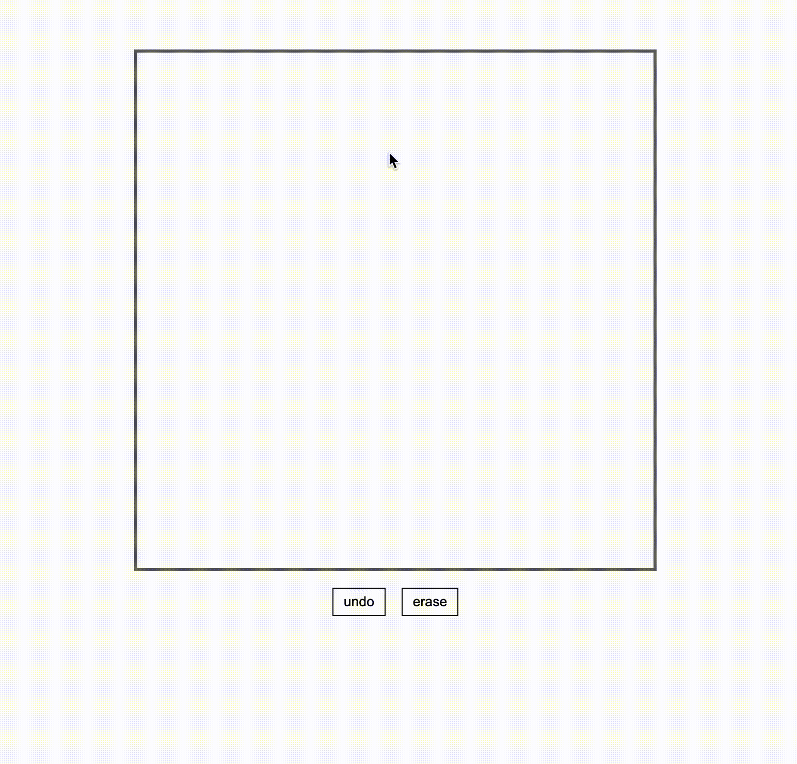

 <h1>✏️<a href="https://ubugeeei.github.io/tecack">Tecack</a></h1>
 
The hand-writing recognition engine built with TypeScript.

 

---

See More: [Documentation](https://ubugeeei.github.io/tecack) | [Quick Start](https://ubugeeei.github.io/tecack/introduction/getting-started.html)

Forked from KanjiCanvas (https://github.com/asdfjkl/kanjicanvas) 💓
